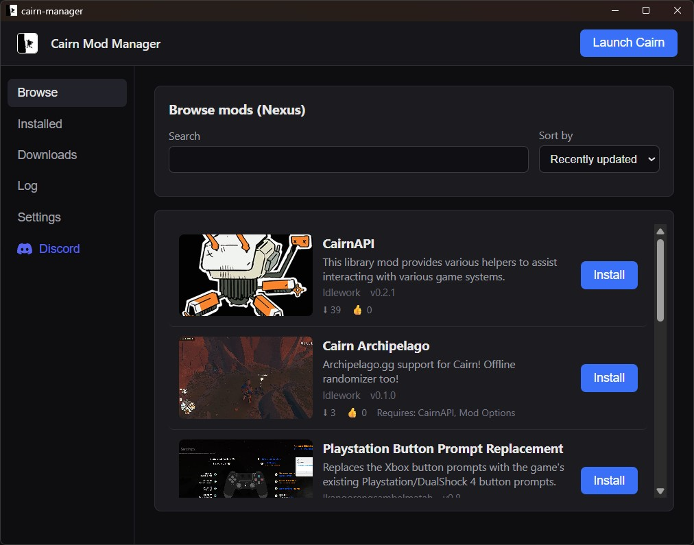

<div align="center">

# Cairn Mod Manager

Browse, install, and update [Cairn](https://store.steampowered.com/app/1588550/) mods.

[](https://github.com/CairnModding/CairnModManager/releases/latest)
&nbsp;
[](https://discord.gg/fnhvPzRhtA)



</div>

## Features

- Browse and install mods from Nexus.
- Update, enable, disable, or uninstall them.
- Installs MelonLoader for you.
- Edit mod settings.
- Launch the game.
- Updates itself.

## Setup

1. [Download](https://github.com/CairnModding/CairnModManager/releases/latest) and run the installer.
2. Point it at your Cairn folder, or let it auto-detect.
3. Install MelonLoader from the app.
4. Add your [Nexus API key](https://cairn.ldlework.com/help/#nexus-token) in Settings, then browse mods.

## Development

Built with [Tauri](https://tauri.app) and React. Needs Node.js and the Rust toolchain.

```sh
npm install
npm run tauri dev      # run in dev
npm run tauri build    # build installers
```

Pushing a `vX.Y.Z` tag that matches the version in `src-tauri/tauri.conf.json` builds the installers and drafts a release.

<div align="center">
<sub>Not affiliated with The Game Bakers.</sub>
</div>
